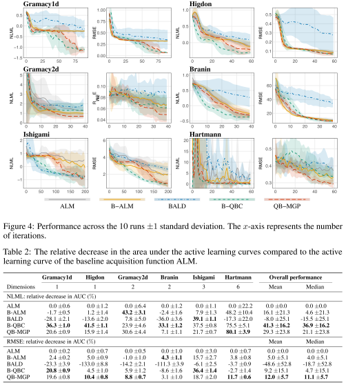

# Bayesian Active Learning for fully Bayesian Gaussian Processes
This work reproduces the experiments from our paper: [Bayesian Active Learning for fully Bayesian Gaussian Processes](https://arxiv.org/abs/2205.10186).

To reproduce the results in the paper, run the bash file `run_all_experiments.sh`.

